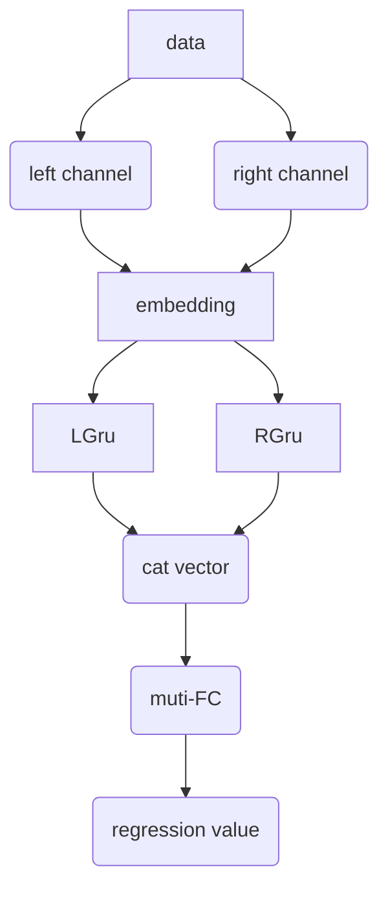

[toc]

# 基于移动终端的风速测量方法

## 2020.11.1

完成了数据的清洗和整理，将所有的风速数据以规整的三阶张量的形式存入了二进制文件中，并将对应的标签整理进了易于查找的`json`文件中。

## 2020.12.9

- 完成了项目工具集的开发。
- 完成了数据集的制作。

下面是数据集的整理逻辑：

数据集存入了`.npy`文件中整体是一个三阶张量，它的`shape`为
$$
\begin{align}
&[batch\_num, channel\_num, sample\_rate]\\\\
&batch\_num:样本数量\\
&channel\_num:采样的波形文件的通道数量，本例中一般为2，代表存储的是双声道\\
&sample\_rate:代表存储波形文件的采样率，此例中为22050，代表每秒的波形有22050个点表示
\end{align}
$$
对应的标签也存入了`.npy`中。

- 完成了RNN网络前馈逻辑的搭建。
- 完成了网络的训练和评估，当前构建逻辑的网络效果并不理想。

下面是网络的前馈架构：

训练的下降曲线：

测试集上的效果：

